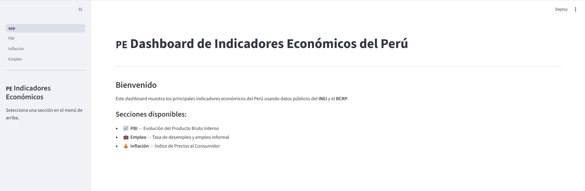
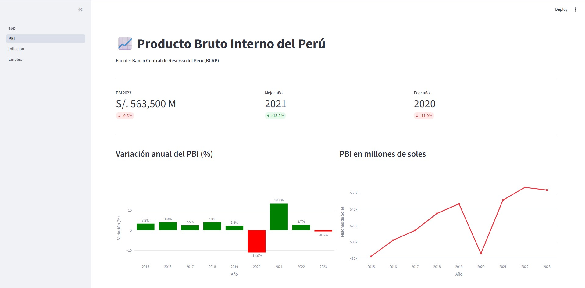
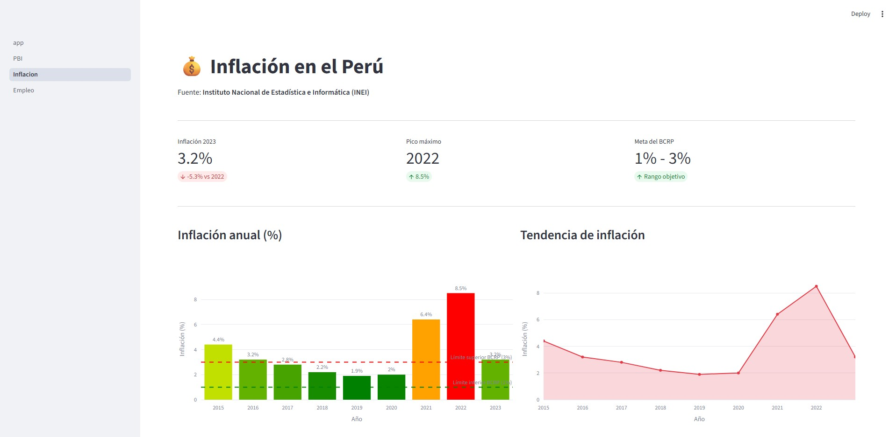
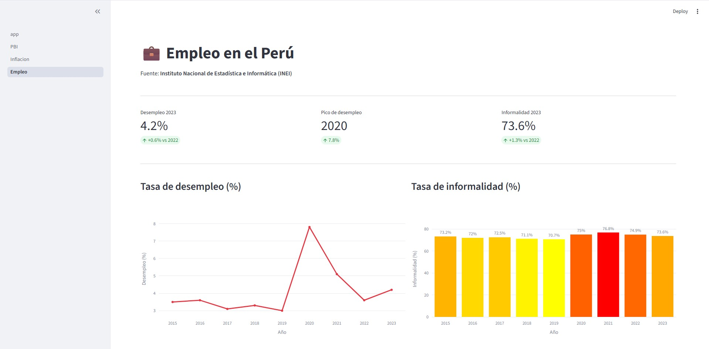

# Dashboard de Indicadores Económicos del Perú 🇵🇪

Dashboard interactivo que visualiza los principales indicadores económicos del Perú usando datos públicos del BCRP e INEI.

## Screenshots

### Página principal








## Tecnologías
- **Python 3**
- **Streamlit** — Dashboard interactivo
- **Pandas** — Procesamiento de datos
- **Plotly** — Visualizaciones interactivas

## Fuentes de datos
- [Banco Central de Reserva del Perú (BCRP)](https://www.bcrp.gob.pe)
- [Instituto Nacional de Estadística e Informática (INEI)](https://www.inei.gob.pe)

## Instalación
```bash
git clone https://github.com/curotto/peru-economic-dashboard.git
cd peru-economic-dashboard
python -m venv venv
venv\Scripts\activate
pip install -r requirements.txt
```

## Uso
```bash
streamlit run app.py
```

Abre tu navegador en `http://localhost:8501`

## Secciones

| Sección | Descripción |
|---------|-------------|
| 📈 PBI | Variación y evolución del Producto Bruto Interno |
| 💰 Inflación | Índice de Precios al Consumidor vs meta del BCRP |
| 💼 Empleo | Tasa de desempleo e informalidad laboral |